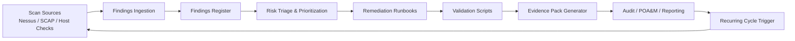
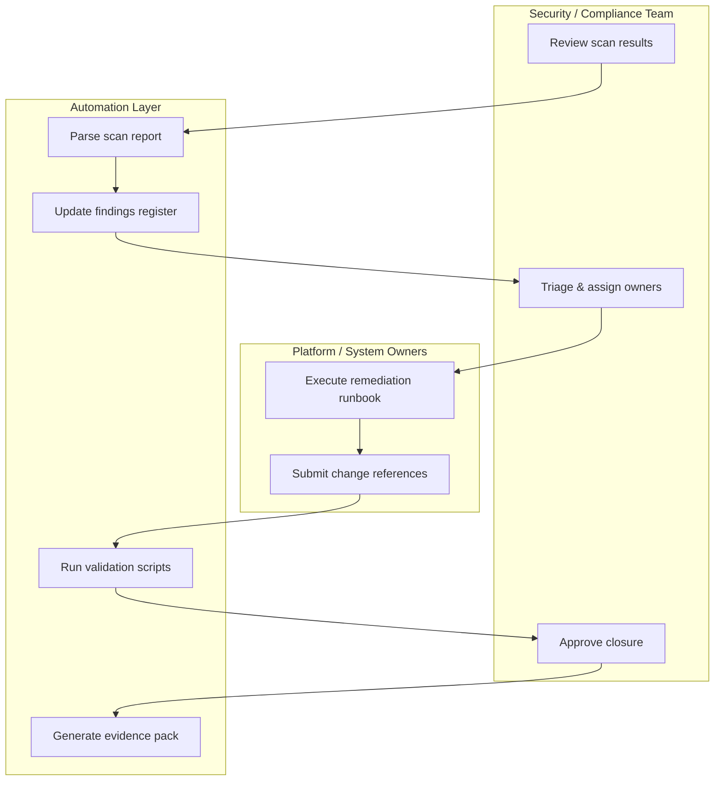
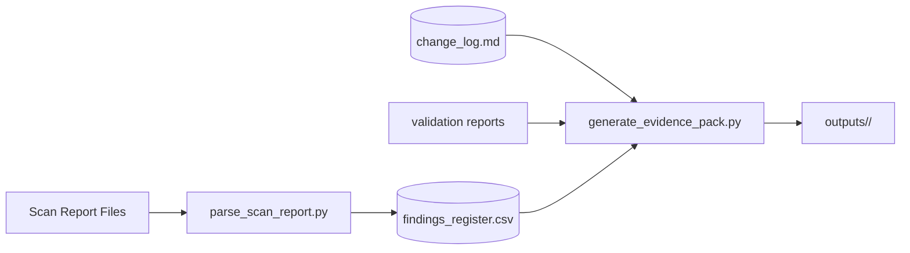
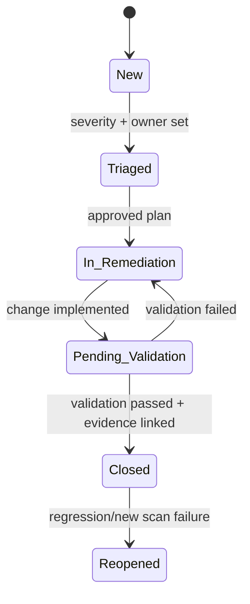
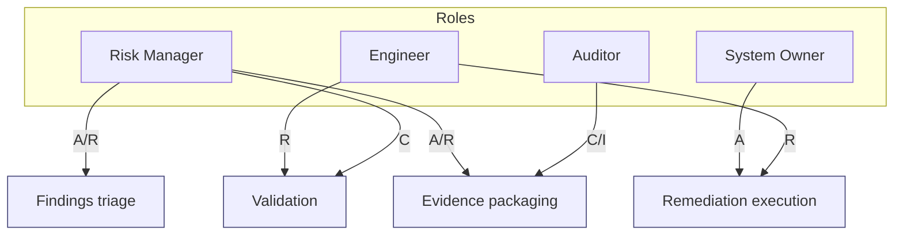
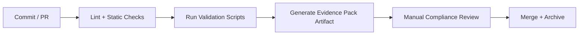
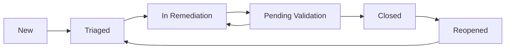
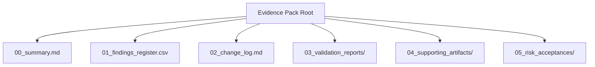
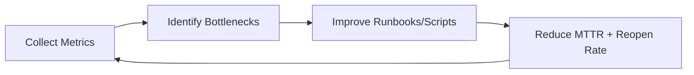

# Compliance Automation Toolkit


A practical, audit-oriented blueprint for running a **repeatable compliance lifecycle** from scan ingestion through remediation, validation, and evidence packaging.

> This README is intentionally thorough so teams can adopt it as an implementation guide, not just a project description.

---

## Table of Contents

- [1) What this toolkit is](#1-what-this-toolkit-is)
- [2) Compliance lifecycle at a glance](#2-compliance-lifecycle-at-a-glance)
- [3) End-to-end architecture diagrams](#3-end-to-end-architecture-diagrams)
- [4) Repository structure](#4-repository-structure)
- [5) Prerequisites](#5-prerequisites)
- [6) Quick start (fully functional workflow)](#6-quick-start-fully-functional-workflow)
- [7) Operating model](#7-operating-model)
- [8) Data model and templates](#8-data-model-and-templates)
- [9) Runbook standards](#9-runbook-standards)
- [10) Validation standards](#10-validation-standards)
- [11) Evidence pack standards](#11-evidence-pack-standards)
- [12) Recurring operations cadence](#12-recurring-operations-cadence)
- [13) Metrics, KPIs, and reporting](#13-metrics-kpis-and-reporting)
- [14) Resource links](#14-resource-links)
- [15) Contribution workflow](#15-contribution-workflow)
- [16) Troubleshooting](#16-troubleshooting)
- [17) License](#17-license)

---

## 1) What this toolkit is

This toolkit helps you implement a structured compliance process:

1. Ingest vulnerability scan outputs (e.g., Nessus/SCAP/host checks).
2. Normalize findings into a **single findings register**.
3. Execute remediation via approved runbooks.
4. Validate control state with platform-specific checks.
5. Generate an **audit-ready evidence pack**.
6. Repeat on a fixed operational cadence.

### Primary outcomes

- **Traceability**: every finding maps to owner, status, due date, and evidence.
- **Repeatability**: workflow can be run weekly/monthly/quarterly.
- **Audit readiness**: evidence is organized by case/run and linked to changes.
- **Scalability**: process works for a few hosts or a large estate.

---

## 2) Compliance lifecycle at a glance



---

## 3) End-to-end architecture diagrams

### 3.1 Process swimlane (people + automation)



### 3.2 Data flow diagram



### 3.3 State machine for findings lifecycle



### 3.4 RACI responsibility map



---

## 4) Repository structure

> The structure below is the intended operating layout.

```text
Compliance-Automation-Toolkit/
├── README.md
├── templates/
│   ├── findings_register.csv
│   └── change_log.md
├── docs/
│   ├── remediation-runbooks/
│   │   ├── windows/
│   │   └── linux/
│   ├── evidence-pack-template.md
│   └── workflow.md
├── scripts/
│   ├── parse_scan_report.py
│   ├── validate_linux.sh
│   ├── validate_windows.ps1
│   └── generate_evidence_pack.py
├── outputs/
│   └── .gitkeep
└── examples/
```

---

## 5) Prerequisites

### Required tools

- Git
- Python 3.10+
- Bash (Linux/macOS) and/or PowerShell 5+ (Windows)

### Recommended tooling

- CSV/Spreadsheet editor for findings triage
- CI runner (GitHub Actions, GitLab CI, Jenkins, etc.)
- Ticketing integration (Jira, ServiceNow, Azure Boards)

### Security prerequisites

- Ensure scan reports and evidence packs are stored in approved repositories.
- Do not commit sensitive hostnames, credentials, or classified data to public repos.

---

## 6) Quick start (fully functional workflow)

### 6.1 Bootstrap the expected directory structure

Run from repository root:

```bash
mkdir -p templates docs/remediation-runbooks/windows docs/remediation-runbooks/linux scripts outputs examples
```

### 6.2 Create initial templates

**`templates/findings_register.csv`** (header example):

```csv
finding_id,asset,severity,control_ref,description,recommendation,owner,status,evidence_link,date_identified,target_date,date_closed,source_scan
```

**`templates/change_log.md`** (starter):

```md
# Change Log

| Date | Change Ticket | System | Summary | Implemented By | Approval |
|------|---------------|--------|---------|----------------|----------|
```

### 6.3 Add runbooks

Place runbooks under:

- `docs/remediation-runbooks/windows/`
- `docs/remediation-runbooks/linux/`

Each runbook should define:

- Objective
- Scope and affected systems
- Pre-checks
- Step-by-step implementation
- Rollback steps
- Validation commands
- Required evidence artifacts

### 6.4 Validation script usage

Linux example:

```bash
bash scripts/validate_linux.sh --mode check
```

Windows example:

```powershell
powershell -ExecutionPolicy Bypass -File scripts\validate_windows.ps1 -Mode Check
```

### 6.5 Evidence generation

```bash
python scripts/generate_evidence_pack.py --case COMPLIANCE-001 --out outputs/COMPLIANCE-001/
```

Expected pack content:

- findings register snapshot
- change log snapshot
- validation results
- summary narrative
- closure decision (pass/fail/open-risk)

### 6.6 Recommended CI pipeline gates



---

## 7) Operating model

### Severity-based remediation targets (example)

| Severity | Triage SLA | Remediation SLA | Validation SLA |
|---|---:|---:|---:|
| Critical | 1 business day | 7 calendar days | 2 business days |
| High | 2 business days | 14 calendar days | 3 business days |
| Medium | 5 business days | 30 calendar days | 5 business days |
| Low | 10 business days | 60 calendar days | 10 business days |

> Adjust SLAs to your policy baseline (e.g., RMF, ISO, CIS, SOC2).

### Governance checkpoints

- Triage approval by Security/Compliance lead
- Change approval by system owner or CAB
- Closure approval after validation and evidence review

---

## 8) Data model and templates

### 8.1 Findings register field definitions

| Column | Description |
|---|---|
| `finding_id` | Stable unique identifier from scanner or normalized ID |
| `asset` | Hostname, instance ID, device ID, or application component |
| `severity` | Critical/High/Medium/Low (or numeric score) |
| `control_ref` | STIG ID / CCI / NIST 800-53 / CIS reference |
| `description` | Human-readable finding summary |
| `recommendation` | Required fix or compensating control |
| `owner` | Team or individual accountable for remediation |
| `status` | New/Triaged/In Remediation/Pending Validation/Closed/Reopened |
| `evidence_link` | URI/path to supporting validation and change artifacts |
| `date_identified` | Initial detection date |
| `target_date` | Agreed due date |
| `date_closed` | Closure date once validated |
| `source_scan` | Originating scanner/report file |

### 8.2 Status progression diagram



---

## 9) Runbook standards

A high-quality remediation runbook should include:

1. **Control context**: Why this setting matters.
2. **Technical procedure**: Exact commands/configuration changes.
3. **Validation command set**: Positive and negative checks.
4. **Rollback**: Recovery steps if impact occurs.
5. **Evidence requirements**: output logs, screenshots, ticket IDs.
6. **Known exceptions**: acceptable risk scenarios and approval path.

---

## 10) Validation standards

Validation scripts should be:

- **Idempotent for checks** (safe to run repeatedly)
- **Explicitly non-destructive** by default
- **Machine-readable** in output when possible (JSON/CSV)
- **Timestamped** and tied to a finding/control ID

Suggested output naming:

```text
outputs/<case-id>/validation/<asset>_<control>_<timestamp>.json
```

---

## 11) Evidence pack standards

### Minimum evidence checklist

- Findings register snapshot (time-bounded)
- Linked change requests/tickets
- Script output proving control state
- Analyst summary (what was fixed, what remains)
- Formal risk acceptance for exceptions

### Evidence package structure



---

## 12) Recurring operations cadence

| Cadence | Activities | Typical owner |
|---|---|---|
| Weekly | Ingest scans, triage new findings, update statuses | Security Operations |
| Monthly | Validate aging findings, verify evidence completeness | Compliance Team |
| Quarterly | Control mapping review, trend analysis, sampling audit | Governance/Risk |

### Continuous improvement loop



---

## 13) Metrics, KPIs, and reporting

Track at minimum:

- Mean time to remediate (MTTR) by severity
- Open findings count by age bucket
- Reopen rate after closure
- Validation pass rate
- Evidence completeness rate per audit window

Example age buckets:

- 0–7 days
- 8–30 days
- 31–60 days
- 61+ days

---

## 14) Resource links

### Compliance and control frameworks

- NIST SP 800-53 Rev. 5: https://csrc.nist.gov/publications/detail/sp/800-53/rev-5/final
- NIST National Vulnerability Database (NVD): https://nvd.nist.gov/
- DISA STIG portal: https://public.cyber.mil/stigs/
- CIS Benchmarks: https://www.cisecurity.org/cis-benchmarks
- CISA Known Exploited Vulnerabilities Catalog: https://www.cisa.gov/known-exploited-vulnerabilities-catalog

### Vulnerability scoring and taxonomy

- CVSS: https://www.first.org/cvss/
- CWE: https://cwe.mitre.org/
- CPE dictionary: https://nvd.nist.gov/products/cpe

### Operational guidance

- NIST SP 800-40 (enterprise patch management): https://csrc.nist.gov/publications/detail/sp/800-40/rev-4/final
- NIST SP 800-61 Rev. 2 (incident handling): https://csrc.nist.gov/publications/detail/sp/800-61/rev-2/final
- OWASP Logging Cheat Sheet: https://cheatsheetseries.owasp.org/cheatsheets/Logging_Cheat_Sheet.html

---

## 15) Contribution workflow

1. Create or update templates/runbooks/scripts.
2. Validate against sample findings.
3. Generate an evidence pack artifact.
4. Open PR with:
   - change summary
   - controls affected
   - validation output snapshot
   - rollback notes

---

## 16) Troubleshooting

### Common issues

- **No closure despite fix applied**: validation script may not cover the exact control expression.
- **Evidence rejected in audit**: missing linkage to change ticket or finding ID.
- **Frequent reopen events**: remediation not codified; enforce config management baseline.

### Diagnostic checklist

- Is the finding mapped to a single owner?
- Is remediation tied to a tracked change?
- Did validation run after implementation (not before)?
- Is evidence immutable/versioned and timestamped?

---

## 17) License

MIT
